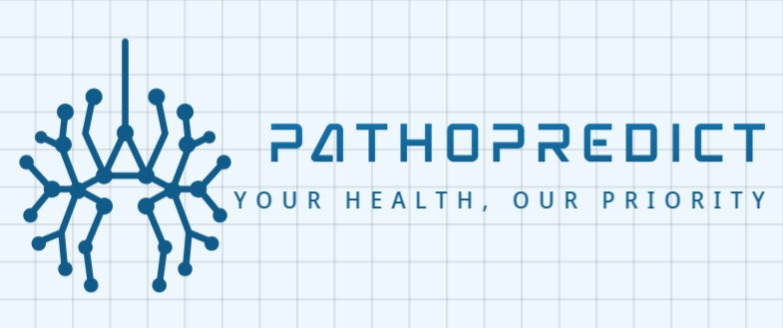

# TeamPathoPredict(ML Based project on TB diagnosis (Hackofiesta 6.0))

	
	 

Tuberculosis (TB) remains a global health problem, and is the leading cause of death from an infectious disease. A crucial step in the treatment of tuberculosis is screening high risk populations and the early detection of the disease, with chest x-ray (CXR) imaging being the most widely-used imaging modality. As such, there has been significant recent interest in artificial intelligence-based TB screening solutions for use in resource-limited scenarios where there is a lack of trained healthcare workers with expertise in CXR interpretation.
By this pressing need , we Introduce *PathoPredict* . This AI-powered TB detection helps in detecting TB faster and with more precision. 

## Requirements ##

The main requirements are listed below. A full list can be found in "requirements.txt".

* Tested with Tensorflow 1.15
* OpenCV 4.5.1
* Python 3.6
* Numpy 1.19.5
* Scikit-Learn 0.24.1

## Current Techstack ##

1. Frontend : CSS ,HTML , JS 
2. Backend : FLask/ django ( since flask is diffcult to understand but easy to implement ) . 
3. Design : Spline 
4. APIs : REACT , TWILIO , GENAI 
5. ML Model : CNN

